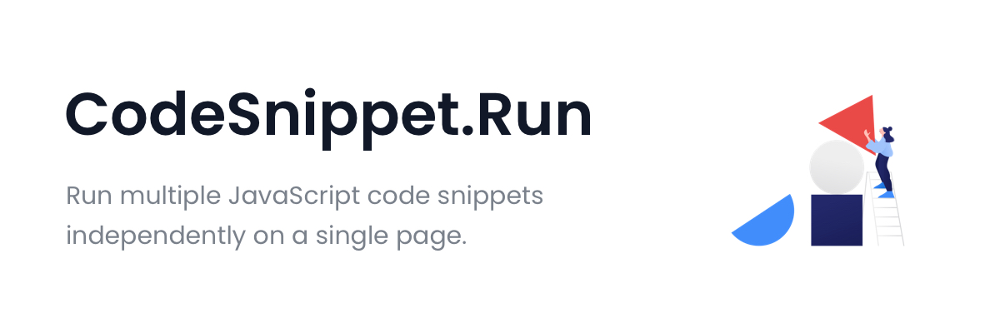

  

# CodeSnippet.Run

Run multiple JavaScript code snippets independently on a single page.

## Website

[CodeSnippet.Run](https://dutiyesh.github.io/codesnippet.run)

 

  

  

## Progress

- [x] Create snippet
- [ ] Save snippet
- [ ] Delete snippet
- [ ] Share snippet
- [ ] Embed snippet
- [ ] Resize Editor
- [ ] Multiple Editor theme

## Contribution

Suggestions and pull requests are welcomed!

## Support

---

This project was bootstrapped with [Create React App](https://github.com/facebook/create-react-app).
